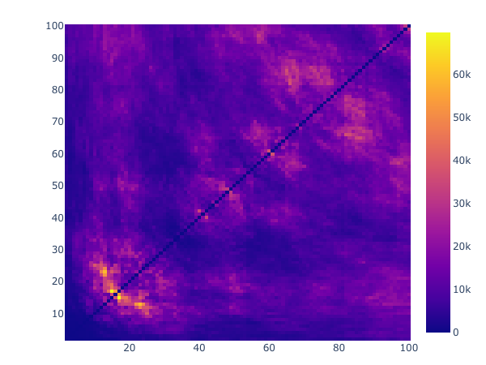

# vectorbt


vectorbt is a backtesting library on steroids. It operates entirely on NumPy arrays and is powered by [Numba](https://github.com/numba/numba) to backtest and analyze trading strategies at scale. It also integrates [plotly.py](https://github.com/plotly/plotly.py) and [ipywidgets](https://github.com/jupyter-widgets/ipywidgets) to display complex charts and dashbaords akin to Tableau right in the Jupyter notebook. Due to its high processing performance, vectorbt is able to re-calculate data on the fly, thus enabling the user to interact with data-hungry widgets without significant delays.

## Motivation

While there are [many other great backtesting packages for Python](https://github.com/mementum/backtrader#alternatives), vectorbt is more of a data mining tool: it excels at processing performance and offers interactive tools to explore complex phenomena in trading. With it you can traverse a huge number of parameter combinations, time periods and instruments in no time, to explore where your strategy performs best and even to uncover hidden patterns in data.

Take a simple [Dual Moving Average Crossover](https://en.wikipedia.org/wiki/Moving_average_crossover) strategy for example. By calculating the performance of each reasonable window combination and plotting the whole thing as a heatmap (as we do below), you can easily identify how performance depends on window size. If you additionally calculate the same heatmap over multiple time periods, you will also spot how performance varies with downtrends and uptrends. By doing the same for other strategies such as holding and trading randomly, you can even compare them using significance tests. With vectorbt, this analysis can be done in minutes, and will effectively save you days of getting the same insights using other libraries.

Here a snippet for testing 4851 window combinations of a dual SMA crossover strategy on the whole Microsoft stock history in about 5 seconds:

```python
import vectorbt as vbt
import numpy as np
import itertools
import yfinance as yf

# Prepare data
msft = yf.Ticker("MSFT")
history = msft.history(period="max")
ohlcv = vbt.OHLCV.from_df(history)
investment = 100 # $

# Create window combinations
windows = np.arange(2, 101)
comb = itertools.combinations(np.arange(len(windows)), 2) # twice less params
fast_idxs, slow_idxs = np.asarray(list(comb)).transpose()
fast_windows, slow_windows = windows[fast_idxs], windows[slow_idxs]

# Calculate the performance of the strategy
dmac = vbt.DMAC(ohlcv.open, fast_windows, slow_windows)
entries, exits = dmac.crossover_signals()
positions = vbt.Positions.from_signals(entries, exits)
portfolio = vbt.Portfolio(ohlcv.open, positions, investment=investment)
tnp = portfolio.total_net_profit

# Plot heatmap
tnp_matrix = np.empty((len(windows), len(windows)))
tnp_matrix[fast_idxs, slow_idxs] = tnp
tnp_matrix[slow_idxs, fast_idxs] = tnp # symmetry

vbt.Heatmap(data=tnp_matrix, x_labels=windows, y_labels=windows, width=600, height=450).show_png()
```



## How it works?

It combines NumPy and Numba sauce to obtain orders-of-magnitude speedup over other libraries. Take for example pandas: while certain pandas operations such as window functions are partially compiled with Cython and/or Numba, Numba cannot do any compilation on pandas objects and thus they cannot be accessed within a user-defined Numba code. Moreover, some operations may be extremely slow compared to their NumPy counterparts; for example, the `pct_change` operation in NumPy is nearly 70 times faster than its pandas equivalent:

```
a = np.random.randint(10, size=(1000, 1000)).astype(float)
a_df = pd.DataFrame(a)

%timeit np.diff(a, axis=0) / a[:-1, :]
3.69 ms ± 110 µs per loop (mean ± std. dev. of 7 runs, 100 loops each)

%timeit a_df.pct_change()
266 ms ± 7.26 ms per loop (mean ± std. dev. of 7 runs, 1 loop each)
```

Each vectorbt class is a subclass of `np.ndarray` with a custom set of methods optimized for working with time series data. For example, the `Signals` class is a binary NumPy array supporting advanced binary operations. Each method is either vectorized or Numba compiled for best peformance. Moreover, each class stricly accepts a 2-dimensional array, where first axis is index (time) and second axis are columns (features), and provides standardized methods for processing 2-dimensional data along first axis. Thus, similar to a `pd.DataFrame`, one can do a single operation to transform tons of columns simultaneously. This, for example, is the magic behind backtesting thousands of window combinations at once.

For more details, check [tests](tests/Modules.ipynb).

## Installation

```
pip install git+https://github.com/polakowo/vectorbt.git
```

Note: importing vectorbt for the first time may take a while due to compilation.

## Examples

- [Testing Dual Moving Average Crossover (DMAC) strategy on Bitcoin](examples/Bitcoin_DMAC.ipynb)
- [Testing stop-loss and trailing stop orders](examples/StopLoss.ipynb)

Note: you will need to run the notebook to play with widgets.
