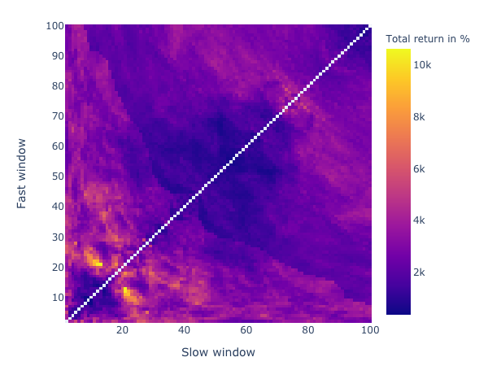

# vectorbt


vectorbt is a backtesting library on steroids - it operates entirely on pandas and NumPy, and is accelerated by [Numba](https://github.com/numba/numba) to backtest and analyze trading strategies at scale. It also integrates [plotly.py](https://github.com/plotly/plotly.py) and [ipywidgets](https://github.com/jupyter-widgets/ipywidgets) to display complex charts and dashboards akin to Tableau right in the Jupyter notebook. Due to its high processing performance, vectorbt is able to re-calculate data on the fly, thus enabling the user to interact with data-hungry widgets without significant delays.

## Motivation

While there are [many other great backtesting packages for Python](https://github.com/mementum/backtrader#alternatives), vectorbt is more of a data mining tool: it excels at processing performance and offers interactive tools to explore complex phenomena in trading. With it you can traverse a huge number of parameter combinations, time periods and instruments in no time, to explore where your strategy performs best and to uncover hidden patterns in data.

Take a simple [Dual Moving Average Crossover](https://en.wikipedia.org/wiki/Moving_average_crossover) strategy for example. By calculating the performance of each reasonable window combination and plotting the whole thing as a heatmap (as we do below), you can easily identify how performance depends on window size. If you additionally calculate the same heatmap over multiple time periods, you will spot how performance varies with downtrends and uptrends. By doing the same for other strategies such as holding and trading randomly, you can compare them using significance tests. With vectorbt, this analysis can be done in minutes, and will effectively save you hours of getting the same insights using other libraries.

### Example

Here a snippet for testing 4851 window combinations of a dual SMA crossover strategy on the whole Bitcoin history in about 3 seconds:

```python
import vectorbt as vbt
import numpy as np
import yfinance as yf

# Define params
windows = np.arange(2, 101)
investment = 100 # in $
commission = 0.001 # in %

# Prepare data
msft = yf.Ticker("BTC-USD")
df = msft.history(period="max")
price = df['Close']

# Calculate the performance of the strategy
dmac = vbt.DMAC.from_combinations(price, windows)
entries, exits = dmac.crossover()
portfolio = vbt.Portfolio.from_signals(price, entries, exits, investment=investment, commission=commission)
performance = portfolio.total_return * 100

# Plot heatmap
perf_df = performance.vbt.unstack_to_df(symmetric=True)
perf_df.vbt.Heatmap(
    xaxis_title='Slow window', 
    yaxis_title='Fast window', 
    trace_kwargs=dict(colorbar=dict(title='Total return in %')),
    width=600, height=450).show_png()
```



## How it works?

vectorbt combines pandas, NumPy and Numba sauce to obtain orders-of-magnitude speedup over other libraries.

It natively works on pandas objects, while performing all calculations using NumPy and Numba under the hood. It introduces a namespace (accessor) to pandas objects (see [extending pandas](https://pandas.pydata.org/pandas-docs/stable/development/extending.html)). This way, user can easily switch betweeen native pandas functionality such as indexing, and highly-performant vectorbt methods. Moreover, each vectorbt method is flexible and can work on both series and dataframes.

In contrast to most other vectorized backtesting libraries where backtesting is limited to simple arrays (think of an array for price, an array for signals, an array for equity, etc.), vectorbt is optimized for working with 2-dimensional data: it treats each index of a dataframe as time axis and each column as a distinct feature that should be backtested, and performs calculations on the entire matrix at once. This way, user can construct huge matrices with millions of columns and calculate the performance for each one with a single matrix operation, without any Pythonic loops. This is the magic behind backtesting thousands of window combinations at once, as we did above.

### Why not only pandas?

While there is a subset of pandas functionality that is already compiled with Cython or Numba, such as window functions, it cannot be accessed within user-defined Numba code, since Numba cannot do any compilation on pandas objects. Take for example generating trailing stop orders: to calculate expanding maximum for each order, you cannot do `df.expanding().max()` from within Numba, but write and compile your own expanding max function wrapped with `@njit`. That's why vectorbt also provides an arsenal of Numba-compiled functions that are ready to be used everywhere.

Moreover, compared to NumPy, some pandas operations may be extremely slow compared to their NumPy counterparts; for example, the `pct_change` operation in NumPy is nearly 70 times faster than its pandas equivalent:

```
a = np.random.randint(10, size=(1000, 1000)).astype(float)
a_df = pd.DataFrame(a)

>>> %timeit np.diff(a, axis=0) / a[:-1, :]
3.69 ms ± 110 µs per loop (mean ± std. dev. of 7 runs, 100 loops each)

>>> %timeit a_df.pct_change()
266 ms ± 7.26 ms per loop (mean ± std. dev. of 7 runs, 1 loop each)
```

Hence, vectorbt uses NumPy + Numba wherever possible in the backtesting pipeline.

#### Broadcasting and indexing

The other problem relies in broadcasting rules implemented in pandas: they are less flexible than in NumPy. Also, pandas follows strict rules regarding indexing; for example, you will have issues using multiple dataframes with different index/columns in the same operation, but such operations are quite common in backtesting (think of combining signals from different indicators, each having columns of the same cardinality but different labels).

To solve this, vectobt borrows broadcasting rules from NumPy and implements itws own indexing rules that allow operations between pandas objects of the same shape, regardless of their index/columns - those are simply stacked upon each other in the resulting object.

For example, consider the following dataframes with different index/columns:

```python
df = pd.DataFrame(
    [[1, 2, 3], [4, 5, 6], [7, 8, 9]], 
    index=pd.Index(['x', 'y', 'z'], name='idx'), 
    columns=pd.Index(['a', 'b', 'c'], name='cols'))
    
df2 = pd.DataFrame(
    [[1, 2, 3], [4, 5, 6], [7, 8, 9]], 
    index=pd.Index(['x2', 'y2', 'z2'], name='idx2'), 
    columns=pd.Index(['a2', 'b2', 'c2'], name='cols2'))
```

Addition operation using pandas yields NaNs:

```
>>> print(df + df2)

     a  a2   b  b2   c  c2
x  NaN NaN NaN NaN NaN NaN
x2 NaN NaN NaN NaN NaN NaN
y  NaN NaN NaN NaN NaN NaN
y2 NaN NaN NaN NaN NaN NaN
z  NaN NaN NaN NaN NaN NaN
z2 NaN NaN NaN NaN NaN NaN
```

Addition operation using vectorbt yields correct results:

```
>>> print(df.vbt + df2.vbt)

cols       a   b   c
cols2     a2  b2  c2
idx idx2            
x   x2     2   4   6
y   y2     8  10  12
z   z2    14  16  18
```

### Why not only NumPy?

Working with NumPy alone, from the user's point of view, is problematic, since important information in form of index and columns and all indexing checks must be explicitly handled by the user, making analysis prone to errors.

But also, vectorized implementation is hard to read or cannot be properly defined at all, and one must rely on an iterative approach instead, which is processing data in element-by-element fashion. That's where Numba comes into play: it allows both writing iterative code and compiling slow Python loops to be run at native machine code speed.

The [previous versions](https://github.com/polakowo/vectorbt/tree/9f270820dd3e5dc4ff5468dbcc14a29c4f45f557) of vectorbt were written in pure NumPy which led to more performance but less usability.

## Features

- Extends pandas using a custom `vbt` accessor
- For high performance, most operations are done stricly using NumPy and Numba 
- Provides a collection of utility functions for working with data ([utils.py](vectorbt/utils.py))
- Extensive input and output validation during execution (data type, shape, etc.)
- Implements NumPy broadcasting for pandas
    - Supports different modes for broadcasting index/columns
- `vbt.timeseries` accessor for working with time-series data ([timeseries.py](vectorbt/timeseries.py))
    - Compiled versions of common pandas functions, such as rolling, groupby, and resample
- `vbt.signals` accessor for working with signals data ([signals.py](vectorbt/signals.py))
    - Entry, exit and random signal generation, ranking and distance functions
    - Generation of stop loss and trailing stop exits signals
- `vbt.portfolio` accessor for modeling portfolio performance ([portfolio.py](vectorbt/portfolio.py))
    - From signals, orders, or custom order function
    - A range of performance time series, metrics, and plotting functions
- Provides a range of technical indicators with full Numba support ([indicators.py](vectorbt/indicators.py))
    - Moving average and STD, Dual Moving Average Crossover, Bollinger Bands, RSI, Stochastic Oscillator, Moving Average Convergence Divergence, and On-balance volume
    - Indicator factory for construction of complex technical indicators in a simplified way
    - Each indicator class offers methods for generating signals and plotting
- Interactive Plotly-based widgets to visualize backtest results ([widgets.py](vectorbt/widgets.py))
    - Gauge, Bar, Scatter, Histogram and Heatmap
    - Full integration with ipywidgets

## Installation

```
pip install git+https://github.com/polakowo/vectorbt.git
```

See [Jupyter Notebook and JupyterLab Support](https://plotly.com/python/getting-started/#jupyter-notebook-support) for Plotly figures.

Note: importing vectorbt for the first time may take a while due to compilation.

## Examples

- [Testing Dual Moving Average Crossover (DMAC) strategy on Bitcoin](examples/Bitcoin-DMAC.ipynb)
- [Comparing stop-loss and trailing stop orders](examples/StopLoss-vs-TrailingStop.ipynb)

Note: you will need to run the notebook to play with widgets.
