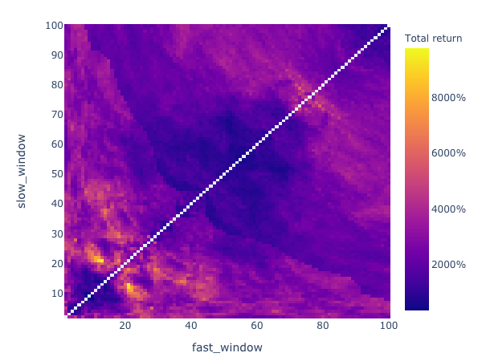
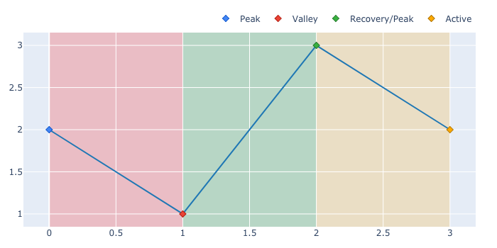
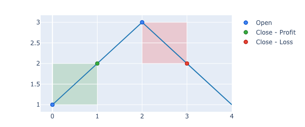

# vectorbt


vectorbt is a backtesting library on steroids - it operates entirely on pandas and NumPy, and is accelerated 
by [Numba](https://github.com/numba/numba) to backtest and analyze trading strategies at speed and scale :fire:

It follows a unique approach to backtesting that builds upon vectorized matrix calculations and fast iterative 
processing with Numba for event-driven backtesting. It also integrates [plotly.py](https://github.com/plotly/plotly.py) 
and [ipywidgets](https://github.com/jupyter-widgets/ipywidgets) to display complex charts and dashboards akin to 
Tableau right in the Jupyter notebook. Due to its high processing performance, vectorbt is able to process data 
on the fly and thus enable the user to interact with data-hungry widgets without significant delays.

## Example

Here a snippet for testing 4851 window combinations of a dual SMA crossover strategy on the whole Bitcoin history 
in under 5 seconds (Note: compiling for the first time may take a while):

```python
import vectorbt as vbt
import numpy as np
import yfinance as yf

# Fetch daily price of Bitcoin
price = yf.Ticker("BTC-USD").history(period="max")['Close']

# Generate signals
fast_ma, slow_ma = vbt.MA.from_combs(price, np.arange(2, 101), 2, names=['fast', 'slow'])
entries = fast_ma.ma_above(slow_ma, crossed=True)
exits = fast_ma.ma_below(slow_ma, crossed=True)

# Model portfolio
portfolio = vbt.Portfolio.from_signals(price, entries, exits, fees=0.001, freq='1 day')

# Get total return and reshape into a matrix indexed by windows
window_ret_matrix = portfolio.total_return.vbt.unstack_to_df(
    index_levels='fast_window', 
    column_levels='slow_window', 
    symmetric=True)

# Plot the whole thing
window_ret_matrix.vbt.Heatmap(
    xaxis_title='Slow window', 
    yaxis_title='Fast window', 
    trace_kwargs=dict(colorbar=dict(title='Total return', tickformat='%')),
    width=600, height=450)
```



## Motivation

While there are [many other great backtesting packages for Python](https://github.com/mementum/backtrader#alternatives), 
vectorbt is more of a data mining tool: it excels at processing performance and offers interactive tools to explore 
complex phenomena in trading. With it you can traverse a huge number of strategy configurations, time periods and 
instruments in little time, to explore where your strategy performs best and to uncover hidden patterns in data.

Take a simple [Dual Moving Average Crossover](https://en.wikipedia.org/wiki/Moving_average_crossover) strategy 
for example. By calculating the performance of each reasonable window combination and plotting the whole thing 
as a heatmap (as we do above), you can easily identify how performance depends on window size. If you additionally 
compute the same heatmap over multiple time periods, you will spot how performance varies with downtrends and 
uptrends. Finally, by running the same pipeline on other strategies such as holding and trading randomly, 
you can compare them and decide whether your strategy is worth executing. With vectorbt, this analysis can 
be done in minutes, and will effectively save you hours of getting the same insights using other libraries.

## How it works?

vectorbt combines pandas, NumPy and Numba sauce to obtain orders-of-magnitude speedup over other libraries.

It natively works on pandas objects, while performing all computations using NumPy and Numba under the hood. 
This way, it is often much faster than pandas alone.

```python-repl
>>> import numpy as np
>>> import pandas as pd
>>> import vectorbt as vbt

>>> big_ts = pd.DataFrame(np.random.uniform(size=(1000, 1000)))

>>> %timeit big_ts.expanding().max()
48.4 ms ± 557 µs per loop (mean ± std. dev. of 7 runs, 10 loops each)

>>> %timeit big_ts.vbt.tseries.expanding_max()
8.82 ms ± 121 µs per loop (mean ± std. dev. of 7 runs, 100 loops each)
```

In contrast to most other similar backtesting libraries where backtesting is limited to simple arrays 
(think of an array for price, an array for signals, etc.), vectorbt is optimized for working with 
2-dimensional data: it treats index of a DataFrame as time axis and columns as distinct features
that should be backtested, and performs calculations on the entire matrix at once. This way, user can 
construct huge matrices with millions of columns and calculate the performance for each one with a single 
matrix operation, without any Pythonic loops.

To make the library easier to use, vectorbt introduces a namespace (accessor) to pandas objects 
(see [extending pandas](https://pandas.pydata.org/pandas-docs/stable/development/extending.html)). 
This way, user can easily switch between native pandas functionality and highly-efficient vectorbt 
methods. Moreover, each vectorbt method is flexible and can work on both Series and DataFrames.

## Features

- Extends pandas using a custom `vbt` accessor
    -> Compatible with any library
- For high performance, most operations are done strictly using NumPy and Numba 
    -> Much faster than comparable functions in pandas
    
```python-repl
# pandas
>>> %timeit big_ts + 1
242 ms ± 3.58 ms per loop (mean ± std. dev. of 7 runs, 1 loop each)

>>> %timeit big_ts.vbt + 1
3.32 ms ± 19.7 µs per loop (mean ± std. dev. of 7 runs, 100 loops each)
```
    
- Utility functions for working with arrays and pandas objects
    - NumPy-like broadcasting for pandas, among other features.
    
```python-repl
# pandas
>>> pd.Series([1, 2, 3]) + pd.DataFrame([[1, 2, 3]])
   0  1  2
0  2  4  6

>>> pd.Series([1, 2, 3]).vbt + pd.DataFrame([[1, 2, 3]])
   0  1  2
0  2  3  4
1  3  4  5
2  4  5  6
```
    
- Functions for working with time series - `vbt.tseries`
    - Compiled versions of common pandas functions, such as rolling, groupby, and resample
    - Drawdown analysis

```python-repl
>>> pd.Series([2, 1, 3, 2]).vbt.tseries.drawdowns().plot()
```



- Functions for working with signals - `vbt.signals`
    - Entry, exit and random signal generation, ranking and distance functions
    - Stop loss, trailing stop and take profit signal generation
    
```python-repl
>>> pd.Series([False, True, True, True]).vbt.signals.first()
0    False
1     True
2    False
3    False
dtype: bool
```
    
- Functions for working with returns - `vbt.returns`
    - Compiled versions of metrics found in [empyrical](https://github.com/quantopian/empyrical)

```python-repl
>>> pd.Series([0.01, -0.01, 0.01]).vbt.returns(freq='1D').sharpe_ratio()
5.515130702591433
```
    
- Class for modeling portfolio performance
    - Accepts signals, orders, and custom order function
    - Provides metrics and tools for analyzing returns, orders, trades and positions
    
```python-repl
>>> order_price = pd.Series([1, 2, 3, 2, 1])
>>> order_size = pd.Series([1, -1, 1, -1, 0])
>>> portfolio = vbt.Portfolio.from_orders(order_price, order_size, freq='1D')
>>> portfolio.trades.plot()
```


    
- Technical indicators with full Numba support
    - Moving average and STD, Bollinger Bands, RSI, Stochastic Oscillator, MACD, and more.
    - Each indicator offers methods for generating signals and plotting
    - Each indicator allows arbitrary parameter combinations, from arrays to Cartesian products
    - Indicator factory for building complex technical indicators in a simple way
    
```python-repl
>>> vbt.MA.from_params(pd.Series([1, 2, 3]), window=[2, 3], 
...      ewm=[False, True], param_product=True).ma
ma_window               2               3          
ma_ewm    False      True  False     True 
0           NaN       NaN   NaN       NaN
1           1.5  1.750000   NaN       NaN
2           2.5  2.615385   2.0  2.428571
``` 
    
- Interactive Plotly-based widgets to visualize backtest results
    - Indicator, Bar, Scatter, Histogram and Heatmap
    - Each provides a method for efficiently updating data
    - Full integration with ipywidgets for displaying interactive dashboards in Jupyter

## Installation

```
pip install git+https://github.com/polakowo/vectorbt.git
```

See [Jupyter Notebook and JupyterLab Support](https://plotly.com/python/getting-started/#jupyter-notebook-support) 
for Plotly figures.

## [Documentation](https://polakowo.io/vectorbt/)

## Example notebooks

- [Who beats Bitcoin: Dual moving average crossover, trading randomly or holding?](examples/Bitcoin-DMAC.ipynb)
- [How stop-loss and trailing stop orders perform on crypto?](examples/StopLoss-vs-TrailingStop.ipynb)

Note: you will need to run the notebook to play with widgets.
