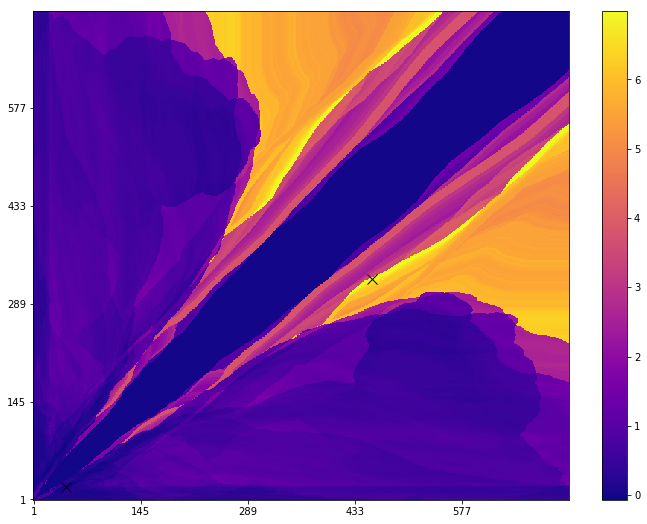
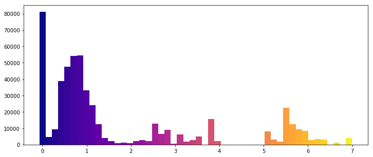
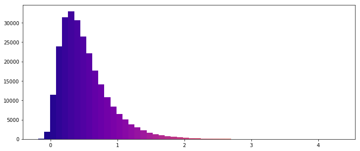

# vector-bt

From indicators, signals, positions, equity, returns, to performance metrics and grid search: This package shares the same approach as Quantopian and Zipline, but designed especially for fast strategy tuning. The code was made blazingly fast by using full vectorization with NumPy and multiprocessing.

The motivation behind this package is simple: *"How to select the optimal windows for a SMA crossover strategy? Which strategy has the lowest risk? Which strategy yields the highest return? Are technical indicators of any use at all?"*

Resulted in some cool animations such as how optimal hyperparameters change over time.

### Installation
```
pip install git+https://github.com/polakowo/vector-bt.git
```

### Tutorial
Tutorial is provided through [Jupyter nbviewer](http://nbviewer.jupyter.org/github/polakowo/vector-bt/blob/master/example.ipynb)

### Bitcoin Example
Exhaustive grid search over Bitcoin price. 

Parameters: 1 year of 2h-period OHLC data, dual SMA crossover strategy with filter of 0.05 * STD and transaction fees of 0.0015 (Poloniex exchange). Heatmap below visualizes grid of SMA windows and the respective rates.



Distribution of expectancy rates in SMA strategy. 



For comparison, here is the distribution of expectancy rates in random strategy.


